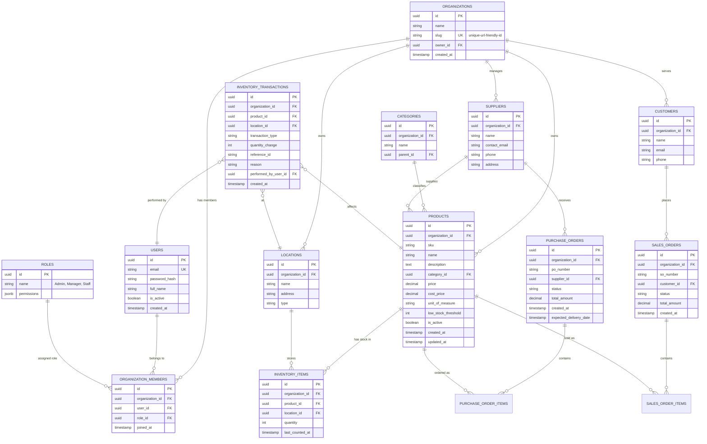

# Database Schema Design (v2 - Multi-Tenant)

## Overview
This document outlines the database structure for the Inventory Management System. We are using **PostgreSQL**. The design follows 3NF and supports **Multi-Tenancy** via an `organizations` table.

## ER Diagram

## Key Changes for Multi-Tenancy

### 1. `organizations` Table
The root entity. All data belongs to an organization.
-   `slug`: Allows for URLs like `app.com/org-slug/dashboard`.

### 2. `organization_members` Table
Links Users to Organizations.
-   Allows a single User (email) to belong to multiple Organizations (e.g., a freelancer working for two companies).
-   Roles are now assigned *per organization*. You can be an Admin in Org A but a Viewer in Org B.

### 3. Row-Level Security (RLS) Preparation
Every single data table (`products`, `orders`, etc.) now has an `organization_id` column.
-   **Constraint**: `unique(organization_id, sku)` for products. SKUs only need to be unique *within* an organization.
-   **Constraint**: `unique(organization_id, po_number)` for orders.

## Detailed Table Specifications (Updates)

#### `users`
*Global user identity.*
| Column | Type | Constraints | Description |
| :--- | :--- | :--- | :--- |
| `id` | UUID | PK | |
| `email` | VARCHAR | UNIQUE | |
| `password_hash` | VARCHAR | | |

#### `organization_members`
| Column | Type | Constraints | Description |
| :--- | :--- | :--- | :--- |
| `id` | UUID | PK | |
| `organization_id` | UUID | FK | |
| `user_id` | UUID | FK | |
| `role_id` | UUID | FK | Role within this org |

#### `products`
| Column | Type | Constraints | Description |
| :--- | :--- | :--- | :--- |
| `id` | UUID | PK | |
| `organization_id` | UUID | FK, Index | **CRITICAL** |
| `sku` | VARCHAR | | Unique per Org |
| ... | ... | ... | |

## Design Decisions
1.  **Shared Database, Separate Rows**: We are using a single database where all tenants share tables, distinguished by `organization_id`. This is the most cost-effective and easiest to manage for self-hosting.
2.  **Global Users**: Users are global entities. This allows a user to switch organizations without logging out and back in.
